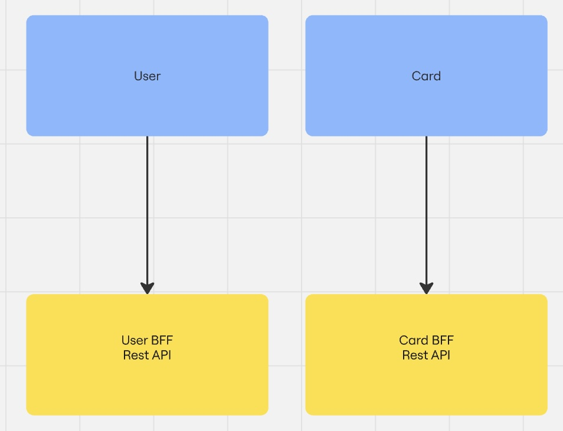

1 и 2 Уровень. 3 уровень не делал.
Легенда: Приложение на данный момент не большое, но в дальнейшем предполагается добавление новых функций и модулей, а
также сверхвысокие нагрузки.
Разбиваем приложение Mesto на микрофронтенды. Используем Вертикальная нарезку.

1. Этап: Предварительный анализ
   Технологии оставим те же React, но если появится необходимость каждый микрофронтенд сможет выбрать нужный ему
   язык/фреймворк.
2. Этап: Определяем бизнес-функции, которыми будут заниматься разные команды:
   Структура микрофонтендов:
    1. User:
        - регистрация пользователя
        - логин/войти в систему
        - редактирование мето информации о пользователе
        - редактирование аватара
    2. Card:
        - отображение списка фотографий
        - загрузка фотографий
        - удаление фотографий
        - сбор и учет лайков под фото

   **Components**
   
   **User:**
   - App.js // Компонент высшего уровня React
   - EditAvatarPopup.js // Редактирование аватара **User**
   - EditProfilePopup.js // Редактирование профиля пользователя **User**
   - Header.js // Компонент регистрации/входа **User**
   - InfoTooltip.js // Компонент результата регистрации **User**
   - Login.js // Компонент логина **User**
   - ProtectedRoute.js // Компонент редиректа для гостя **User**
   - Register.js // Компонент регистрации **User**

     **Card:**
   - AddPlacePopup.js // Компонент добавления новой карточки. Использует **Card**
   - App.js // Компонент высшего уровня React **Card**
   - Card.js // Компонент карточка **Card**
   - Footer.js // Компонент  **Card**
   - ImagePopup.js // Компонент просмотра изображения карточки **Card**
   - Main.js // Компонент список карточек **Card**
   - PopupWithForm.js // Компонент добавление новой карточки. **Card**

3. Этап:
   Методы интеграции микрофронтендов:
   Интегрировать микрофронтенды будем с помощью Run time подхода. Получим преимущества:
    - Развёртывать модули независимо.
    - Динамически обновлять отдельные модули.
    - Сделать масштабирование гибким.

   Методы композиции микрофронтендов:
   Выбираем Гибридная композиция, получаем преимущества, Серверной и Клиенсткой композиций.
   Для реализации прийдется в backend-e добавить слой BFF для каждого микрофронтенда(userBFF, cardBFF)

4. Этап: Инструменты для создания микрофронтендов:
   Будем использовать **Webpack Module Federation**
   Module Federation объединяет разные модули приложения в единое целое и позволяет им использовать общий код.
   В такой композиции есть две роли — хост и удалённый модуль:
    - Хост (host) — это основное приложение. Добавим приложение с именем host.
    - Удалённый модуль (remote) — это отдельный микрофронтенд. В нашем приложени их два: **Card**, **User**
      Конфигурация Module Federation:
    - Чтобы создать микрофронтенды, нужно написать конфигурацию Module Federation для хоста и для каждого удалённого
      модуля.
    - webpack.config.js for User
    - webpack.config.js for Card
    - webpack.config.js for Host
5. Этап: Настройка межмодульного взаимодействия:
   Используем Взаимодействие на основе API. Микрофронтенд общается только со своим микросервисом. Между микрофронтами
   нету прямой связи.   
   